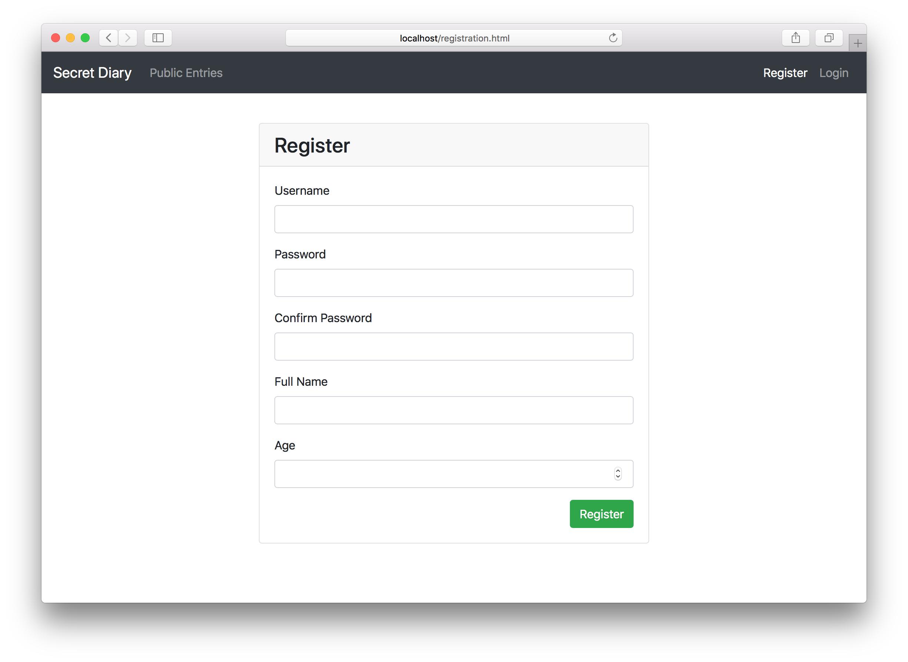
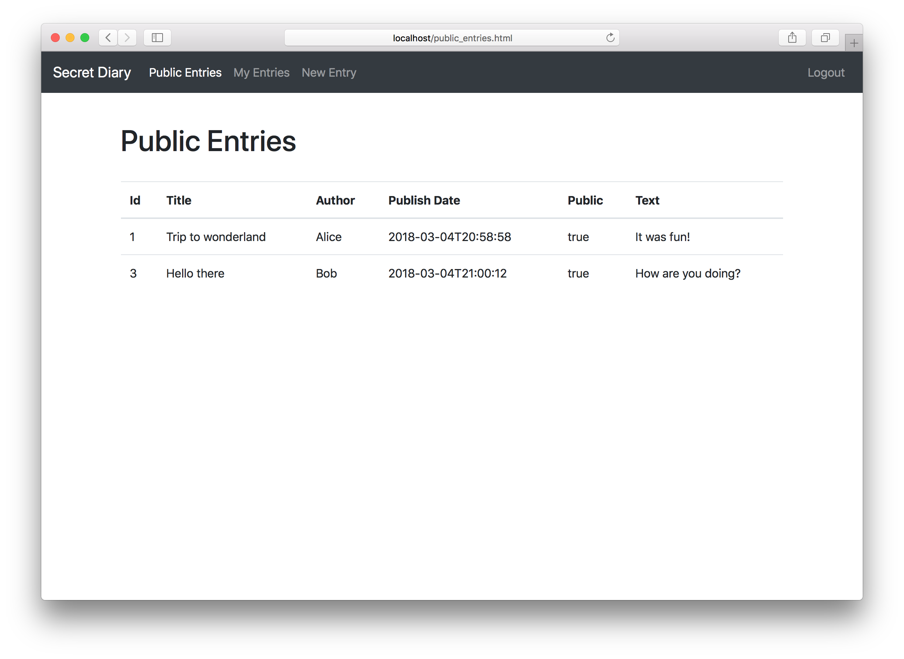
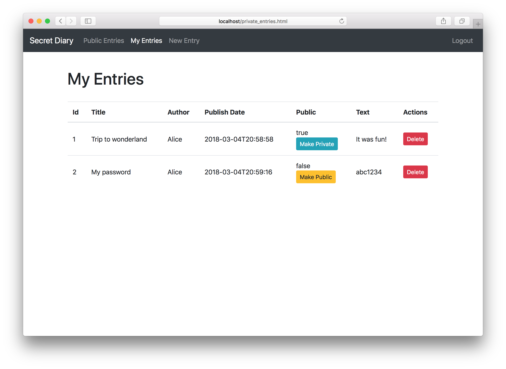
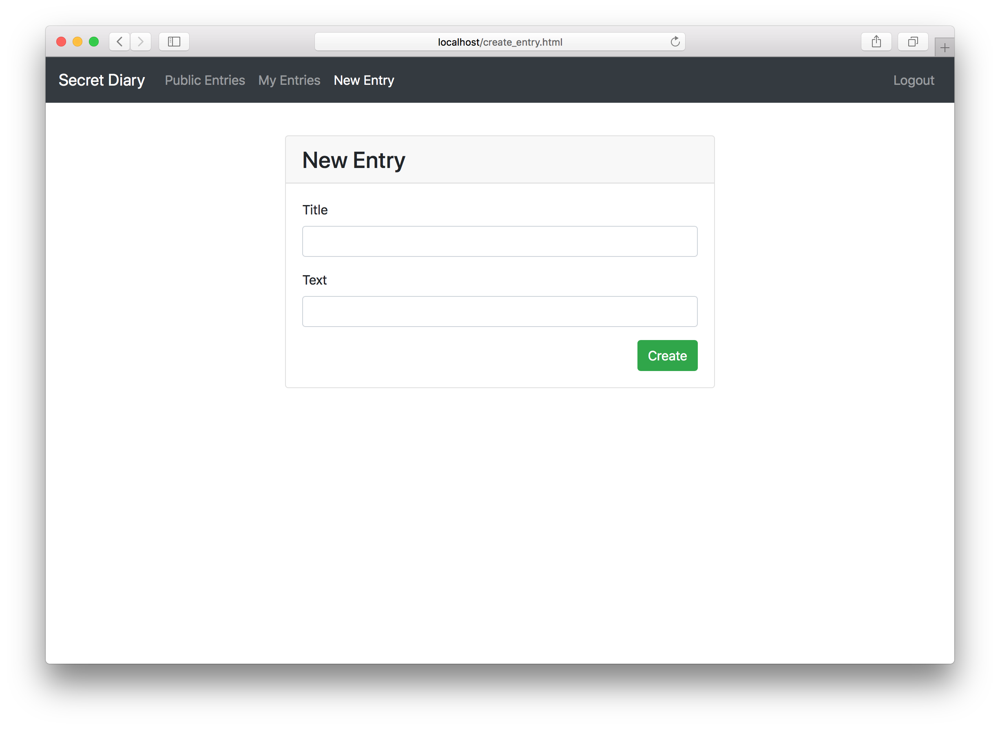

# CS5331 Assignment 1: REST API Development

by [Team CS5331-ACKS](https://github.com/CS5331-ACKS)

Secret Diary is a web application that implements and makes use of the endpoints described in the API specification: https://cs5331-assignments.github.io/rest-api-development/

## Setup

Important files/directories:
- Dockerfile - contains the environment setup scripts to ensure a homogenous development environment
- src/ - contains the front-end code in `html` and the skeleton Flask API code in `service`
- img/ - contains images used for this README

Assuming you're developing on an Ubuntu 16.04 machine, the quick instructions to get up and running are:

### 1. Install Docker

```bash
sudo apt-get update
sudo apt-get install \
    apt-transport-https \
    ca-certificates \
    curl \
    software-properties-common
curl -fsSL https://download.docker.com/linux/ubuntu/gpg | sudo apt-key add -
sudo add-apt-repository \
   "deb [arch=amd64] https://download.docker.com/linux/ubuntu \
   $(lsb_release -cs) \
   stable"
sudo apt-get update
sudo apt-get install docker-ce
```

(Docker CE installation instructions are from this [link](https://docs.docker.com/install/linux/docker-ce/ubuntu/#install-using-the-repository).)

### 2. Verify Docker Works

```bash
sudo docker run hello-world
```

### 3. Run the app

```bash
sudo ./run.sh
```

### 4. Verify that everything runs correctly

The following ports are expected to be accessible:
- 80, on which static HTML content, including the front-end, is served.
- 8080, on which the API is exposed.

To verify this, run the following commands in a different terminal window:

```bash
curl http://localhost:80
curl http://localhost:8080
```

If a response is received, you're good to go.

## Screenshots

### Register


### Login


### View Public Entries


### View Private Entries


### Create New Entry


## Administration and Evaluation

### Team Members

1. Andy Tan Guan Ming
2. Zhu Chunqi
3. Lu Yang Kenneth
4. Ng Si Kai

### Short Answer Questions

#### Question 1: Briefly describe the web technology stack used in your implementation.

Back-end tech stack
- Database - Sqlite was used due to its excellent reputation as an embedded database and ease of use.
- Web Framework - Flask, a python web framework was used.

Front-end tech stack
- Bootstrap - For HTML- and CSS-based design template.
- jQuery - JavaScript library to perform AJAX calls and DOM manipulation.

#### Question 2: Are there any security considerations your team thought about?

We have thought about security when implementing the API and web application. However, not all of the higlighted considerations were implemented due to time restriction.
- SSL should be implemented to provide confidentiality, integrity and authentication for network data between client and server.
- Input validation should be implemented to prevent potential injection attack such as SQL injection, XSS, Command injection and etc.
- Session management should be implemented in order to reduce the probability of session hijacking attack. e.g. Setting absolute timeout.
- Strong user account policy should be implemented. e.g. account lockout, minimum password length, password complexity and etc.
- Access control was implemented so as to ensure that authenticated users will not be able to perform horizontal privilege escalation.
- A whitelist of specific HTTP methods should be implemented for each endpoint in order to prevent potential abuse.
- Content security policy should be implemented as an additional layer of defense for content injection attacks.

#### Question 3: Are there any improvements you would make to the API specification to improve the security of the web application?

- The authentication token could be implemented as a Authorization HTTP header such that it is easier to program against and prevents accidental leaking of the authentication token.
- HTTPS and HSTS should be enabled on the API endpoint server.
- The API specification should be clearer with regards of the authorization provided by the token. For example, adjusting diary permission was not explicitly stated whether the user associated with the authenticated session is authorized to edit the permissions of a diary entry belonging to another user. Ambiguity should be avoided as much as possible.

#### Question 4: Are there any additional features you would like to highlight?

- The API response always tries to provide informative error responses wherever possible so that the frontend may provide useful feedback to the user.
- Automated API tests were written using `Postman`.

#### Question 5: Is your web application vulnerable? If yes, how and why? If not, what measures did you take to secure it?

The web application is vulnerable.

1. Account lockout mechanism was not implemented. This would result in successful account bruteforce attack, leading to account compromise.
2. Minimum password length not implemented. A short password length would require less effort to compromise an account.
3. Vulnerable to eavesdropping and man in the middle attack. This would result in sensitive data exposure and potential integrity impact as the network traffic between client and server is unencrypted.
4. Vulnerable to potential DoS attack as rate limiting mechanism was not implemented.
5. Absolute session timeout was not implemented. Session token would still be valid unless the 'expire' endpoint is called. This may increase the probability of an attacker hijacking the session and impersonate the victim.

#### Feedback: Is there any other feedback you would like to give?

Nope :smile:

### Declaration

1. Andy Tan Guan Ming
    - Wrote frontend queries to backend for 'login', 'registration', 'view public diary entries', 'view authenticated diary entries' and 'create diary entry'
    - Answered security-related questions in README
2. Zhu Chunqi
    - Designed the database schema
    - Implemented the REST API endpoints
3. Lu Yang Kenneth
    - Implemented authentication on each page and design of frontend
    - Organised README and documents for submission
4. Ng Si Kai
    - Refactored all API endpoints to conform to new specifications
    - Implemented persistence of auth token in browser localstorage
